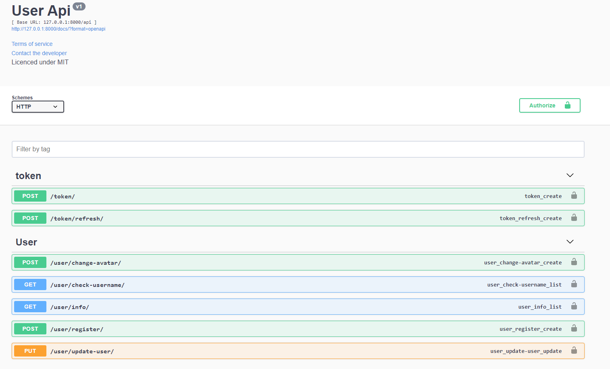

# UserAPI with extending Django Abstract User

User Registeration
Get User Information
Login (TOKEN and Refresh Token)
Check Username
Change Avatar
Update User
with swagger support





----

## Development 

### Requirements

if you want use docker instead of downloading postgres ?

```
docker run -e POSTGRES_HOST_AUTH_METHOD=trust -p 5432:5432 -v D:\userapi\datas:/var/lib/postgresql/data postgres
````

you can change database name and create your database in your database or you can use sqllite db. (change settings.xml)

```
pip install -r requirments.txt
```
### Deploy

Now you are ready to run

```
python manage.py runserver
```

#### Docker Usage
```
docker build . user_api

docker run --network=host user_api
```

NOTE: You can check VSCode run section for easy run after select enviroment.

---
```
MIT License

Copyright (c) 2021 FurkanOzkaya

Permission is hereby granted, free of charge, to any person obtaining a copy
of this software and associated documentation files (the "Software"), to deal
in the Software without restriction, including without limitation the rights
to use, copy, modify, merge, publish, distribute, sublicense, and/or sell
copies of the Software, and to permit persons to whom the Software is
furnished to do so, subject to the following conditions:

The above copyright notice and this permission notice shall be included in all
copies or substantial portions of the Software.

THE SOFTWARE IS PROVIDED "AS IS", WITHOUT WARRANTY OF ANY KIND, EXPRESS OR
IMPLIED, INCLUDING BUT NOT LIMITED TO THE WARRANTIES OF MERCHANTABILITY,
FITNESS FOR A PARTICULAR PURPOSE AND NONINFRINGEMENT. IN NO EVENT SHALL THE
AUTHORS OR COPYRIGHT HOLDERS BE LIABLE FOR ANY CLAIM, DAMAGES OR OTHER
LIABILITY, WHETHER IN AN ACTION OF CONTRACT, TORT OR OTHERWISE, ARISING FROM,
OUT OF OR IN CONNECTION WITH THE SOFTWARE OR THE USE OR OTHER DEALINGS IN THE
SOFTWARE.
```