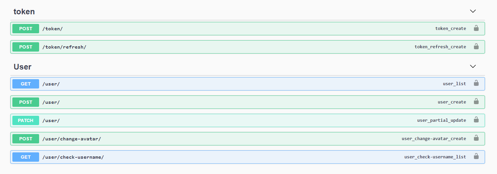

# UserAPI with extending Django Abstract User

User Registeration
Get User Information
Login (TOKEN and Refresh Token)
Check Username
Change Avatar
Update User
with swagger support





----

## Development 

```
docker run -e POSTGRES_HOST_AUTH_METHOD=trust -p 5432:5432 -v D:\userapi\datas:/var/lib/postgresql/data postgres
````

you can change database name and create your database in your database or you can use sqllite db. (change settings.xml)

```
pip install -r requirments.txt
```

now you are ready to run
```
python manage.py runserver
```
NOTE: You can check vs code run section for easy run after select enviroment.

